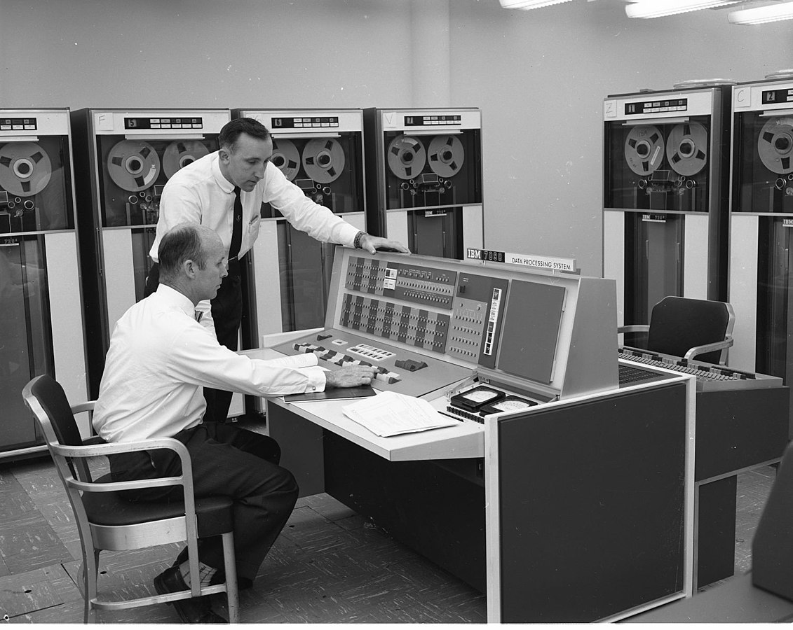
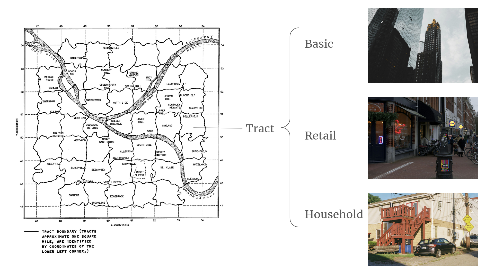
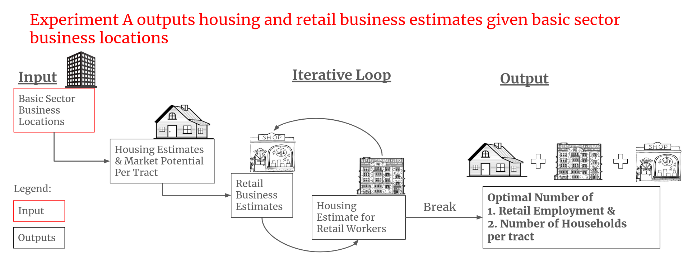
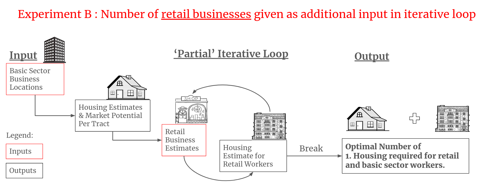
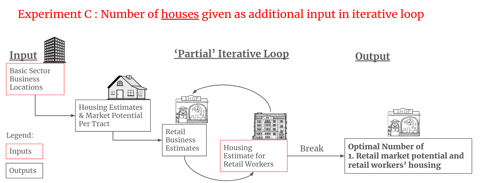
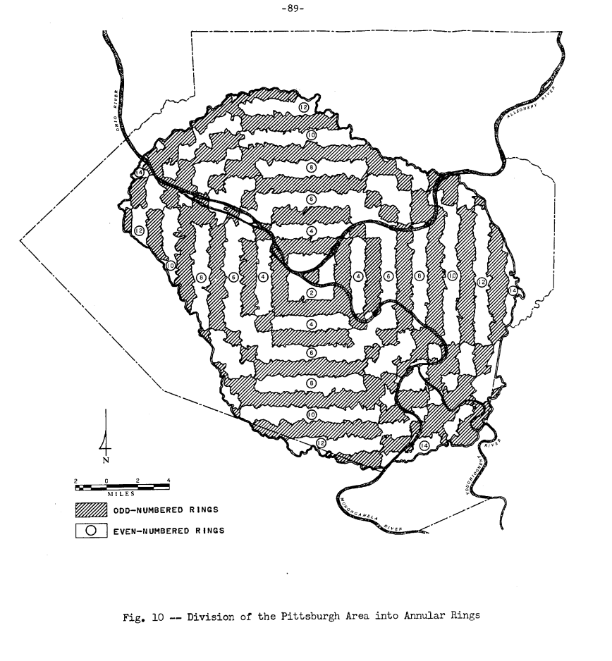
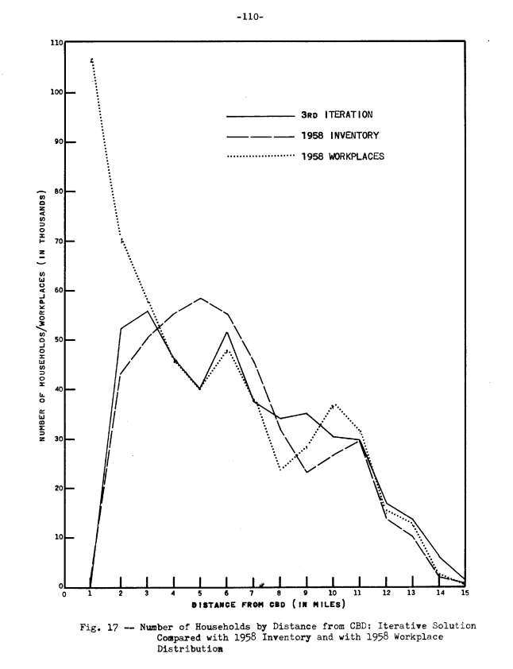

# Math and Urban Planning: Lowry's Pittsburgh Model

Structure:
Word Count 1200 Words

- Introduction (150 words)
- Model Setup (300 words) Actual 268
- Comparison with 1958 Inventory (300 words)
- Model Formulation (300 words) (262)
- Takeaways (150 words)

## Introduction
I live in a densely populated city and I often think about how to make things easier for those around me. On the train, I move towards the middle because I think it'll make it easier for people who're boarding. Somedays, I wonder what it's like to do that at scale? To me, optimisation and urban planning *should* go hand-in-hand since by definition you're always trying to do more (workers, transport, houses) with less (space, space, oh I did I mention space?) The more I thought about it, the more I realised urban planning presents a unique problem because it's not clear what you're trying to optimise for. Is it the inhabitants' happiness, the city's GDP or something else? We'd choose to have it all if we could afford to - offices, houses and parks. But if we *had* to pick, we should pick the 'needs' over the 'wants'. Simple right? But where would you start? 

One man, Ira S. Lowry tried applying mathematical optimisation to this problem. Lowry was an economist working at RAND Corporation. In his time, planners planned the city in parts but there was no way to check how much a change in one part affected the rest of the city. So, Lowry proposed one of the first computational city planning models that simultaneously considered commerce, transportation and housing. The model, formulated as a set of mathematical equations, was published in “A Model of Metropolis" in 1964.

## Model Setup
Lowry based his model on the city of Pittsburgh, which he divided into 1-sq mile pieces he called 'tracts'. Each tract had three land-use types:

1. **Basic sector.** Businesess that primarily serve clients outside the city. This sector is designed to be unaffected by the movement of the local population. 

2. **Retail sector.** Similar to (1) but local facing. The implication here is that these businesses/services *would* be affected by shifts in the local population. For instance, fewer households in the tract would mean lesser demand for schools and grocery stores.

3. **Household sector.** The number of households in the area, which the retail sector is dependent on. 

The general idea is that the planner inputs the location of basic sector businesses, and the model produces estimates the other two variables - the number of households and retail businesses which should be in each tract. This was done in a “part-waterfall-part-iterative” process. I'll explain what that means. 

At the start, the model distributes housing across the city based on the location of basic sector workplaces.  After this, the “market potential” of each tract is calculated. Lowry defined “market potential” as the **initial** estimate of how much retail business is required to supply goods and services for a tract and its neighbouring tracts. This portion of the model can be viewed as a waterfall process because it only happens once in the algorithm. The algorithm then goes into a loop to settle the retail workers’ housing in the tracts until the system reaches a predefined equilibrium state. This is based on the humane assumption that retail workers need homes too. 

[Add market potential footnote]
*Market potential def: p.112 a linear combination of the number of workplaces and the number of households in that tract and adjoining tract. The coefficients depend on how far the tract is, this applies for adjacent tracts. For workplaces, coefficients are infinite for distances greater than one mile.*

## Comparison with 1958 inventory
So, how did Lowry know his model was useful in the real world? The first check was internal consistency. Since this model was a set of math equations, he made sure his system had as many equations as unknowns - a necessary condition for a solution. Second, he validated the model outputs with ground truth data from an earlier dataset collected in 1958. The 1958 dataset contained locations of basic sector businesses, land-use data, distribution of households and retail businesses. Lowry designed three experiments to validate different parts of the model. 

Experiment A was a full simulation - Basic sector business locations were given as inputs and the model output was household and retail numbers per tract. Experiment B and C were partial simulations to test the iterative logic of the model. In experiments B and C, Lowry and his team inserted either real-world housing or retail business numbers to the model at the iterative step. They wanted to see if there was any difference in the model’s full solution compared to partially ‘aided’ solution. 

| Experiment | Input                                                | Output                                                  |
|------------|------------------------------------------------------|---------------------------------------------------------|
| A          | - **Basic** employment figures    - Land use data | Distribution of retail employment and household figures |
| B          | - **Basic and Retail** figures                    | Distribution of household figures                       |
| C          | - **Retail** employment figures    - Land use data | Retail employment & market potential*                    |

## Results

Lowry interpreted the results from the three experiments in two ways. The first was to compare the difference in outputs at a tract-by-tract level. The second was to compare the difference in outputs as a measure of the distance from the centre of the city. 

For the second interpretation, the map below visualises Pittsburgh as a set of concentric circles radiating from the CBD. Lowry referred to them as annular rings.

There are way too many interesting results to discuss for each experiment so I've chosen a sample of findings for Experiment A only. My goal isn't to list out everything Lowry has found but rather show the potential of an early computation model used in urban planning.

### Experiment A

To recap the workflow of Experiment A, the basic sector business locations are given as input and the model outputs the population and retail business estimates per tract. Let's look at how the model's household predictions compared with the 1958 ground truth data. 

* Housing Esimates
  * "Tract-by-tract" interpretation

    * The overral $R^2$ is 0.621. This means that the model explains ~62% of the variation in the tract-level housing figures in the city of Pittsburgh.
    * Differences in the model output and real life could be caused by the model's ignorance of the lack of transport infrastructure in some parts of the city. For instance, Lowry observed that the model overestimated the number of households in the Western sector. However, that error turned out to be prediction of future growth in the Western sector of Pittsburgh post-1960, when roads network was significantly improved. Since Lowry wrote the report several years after the 1958 inventory was compiled, he observed that The Fort Pitt Tunnel and a road link to the Greater Pittsburgh Airport led to rapid growth in population and employment in the Western sector. 
  * "Distance-from-centre" interpretation
  
    * We are primarily interested in the "3rd Iteration" and "1958 Inventory" lines. The workplaces line is for additional comparison. From visual inspection, the model output of households generally follow ground truth data. However, there are two large deviations around 4,5,6 and 8,9,10 miles away from the CBD. Lowry's explanation for the deviations in Rings 8,9,10 is that those areas were formerly highlands unsuitable for housing and were only recently developed. So even though the land-use was classified as housing, the population has not reached its peak.

We see here that the two interpretations of Lowry's experiments are not always in agreement. For instance, the difference between the numbers in tract-wise varied a lot but when summed at the annular-ring level, they matched closely to the ground truth figures. 

I've included Lowry's formulation below along with some explanation of what each equation does. I've broken up the model roughly into three groups, area ($A$), employment ($E$) and population ($N$). However, there are some interaction equations between the three decision variables. 

## Model Formulation

**Notations**

| Decision Variable Notations | Meaning                             |
|-----------------------------|-------------------------------------|
| $A$                         | Area of land (thousand square feet) |
| $E$                         | Employment (number of persons)      |
| $N$                         | Population (number of households)   |
| $T$                         | Index of trip distribution          |
| $Z$                         | Constraints                         |

| Super/Subscript Notations | Meaning                                                     |
|---------------------------|-------------------------------------------------------------|
| $U$                       | Usuable Land                                                |
| $B$                       | Basic Sector                                                |
| $R$                       | Retail Sector                                               |
| $H$                       | Household Sector                                            |
| $k$                       | retail sector/shopping trip class                           |
| $m$                       | number of classes of retail establishments ($k = l, ...,m$) |
| $i, j$                    | sub-areas of a bounded region, <u> called tracts </u>       |
| $n$                       | number of tracts ($i=l,...,n; j =1,...n$)                   |

Unspecified functions and coefficients:
$a,b,c,d,e,f,g$

$$
\begin{align}
  A_j &= A_j^U + A_j^B + A_j^R +A_j^H \\
\end{align}
$$

Explanation:

(1) The area of the $j$-th tract is a sum of the following land-use types:

* Usable sector (unoccupied)
* Basic sector (business)
* Retail sectors (business)
* Househould sectors (residential)

$$
\begin{align}
  E^k &= a^k N \\
  E^k &= b^k \left[\sum^n_{k=1} \left(\frac{c^kN_i}{T_{ij}^k} + d^k E_j\right)\right] \\
  E^k  &= \sum^n_{j=1} E^k_j \\
  E_j &= E_j^B + \sum^m_{k=1} E^k_j \\
  A^R_j &= \sum^m_{k=1} e^k E_j^k
\end{align}
$$
Explanation:

(2) $E^k$ denotes the employment for the $k$-th retail sector, a function of how many people live in the area. Lowry supposed that the more people lived in the area, the more employment required in the retail sector. $a^k$ is a weight that represents the market potential of the given location. 

(3) The RHS expresses employment as a measure of distance between homes and shopping areas. $\left(\frac{c^kN_i}{T^k_{ij}}\right)$ is a ratio of the  number of residents in tract $i$ to a score of the distance between tracts $i$ and $j$. It is a confusing but reasonable assumption that people will travel to neighbouring tracts for shopping if it’s not very far away.

(4) The total employment in the $k$-th retail sector is the sum of employment in the $k$-th retail sector in all tracts

(5) Sum of all retail sectors employment and basic sector employment is the total employment for each tract.

(6) Land required for retail is a function of employment figures. More employees = more business = more land for retail needed.

**Household Sector**

$$
\begin{align}
  N &= f \sum^n_{j=1} E_j \\
N_j &= g \sum^n_{i=1} \frac{E_i}{T_{ij}} \\ 
N &= \sum^n_{j=1} N_j \\
\end{align}
$$

(7) The region's population of households is a function of employment. The assumption here is that people can only live if they have jobs to pay for housing.

(8) The number of households in a tract is a function of distance to employment opportunities. The $T_{ij}$ term handles the pair-wise distance between tracts.

(9) Sum of residents in all tracts must equal total population count.

**Constraints**
$$
\begin{align}
E_j^k &\geq Z^k \hspace{0.5cm} \text{, or else $E_j^k=0$} \\
N_j &\leq Z^H_jA^H_j \\
A^R_j &\leq A_j - A^U_j -A^B_j
\end{align} 
$$

(10) Retail employment must hit a minimum number otherwise it will be set to zero. This simulates a minimum economies of scale for retail businesses to be profitable.

(11) The population density of a tract is suppressed by this equation. The greater the accessibility of the tract, the lower the population density.

(12) Amount of land used for retail cannot exceed available land (which equals the sum of land in the $j$-th tract minus all other land use areas)

## Takeaways 

So, where does that leave us? Well, Lowry has shown that math models of cities can be validated, but only for a snapshot in time. In his case, 1958. Even if his model did not fully capture the real-life housing numbers, some perspective could still be gained from investigating the source of the discrepancy as was the case with the Western sector housing. Towards the end of his report, Lowry suggested some possible limitations to the model:

* The model does not take into account any local peculiarities like ethnic cohesiveness, prestige of location, scenery.

* Retail establishments are shifted around without care for the purchasing power of purchasing power.

* The model did not factor in actual transportation routes, instead it uses airline distance (distance between two points on a sphere) to optimise the distribution of households.

I think modelling a city is interesting because good planing means you're helping to make people's lives easier - shorter commutes, more affordable housing etc. And in recent times, it seems like there's still a lot of uncertainty in urban planning because infrastructure takes many years to build, sometimes decades. Further more, governments don't always know how people's living patterns will change during the planning and building process. Just take a look the pre-pandemic tax breaks from governments to US companies. It seems a bit wasted given that people prefer working from home these days. If it's one thing Lowry's model makes clear is that planning a city always begins with money.
